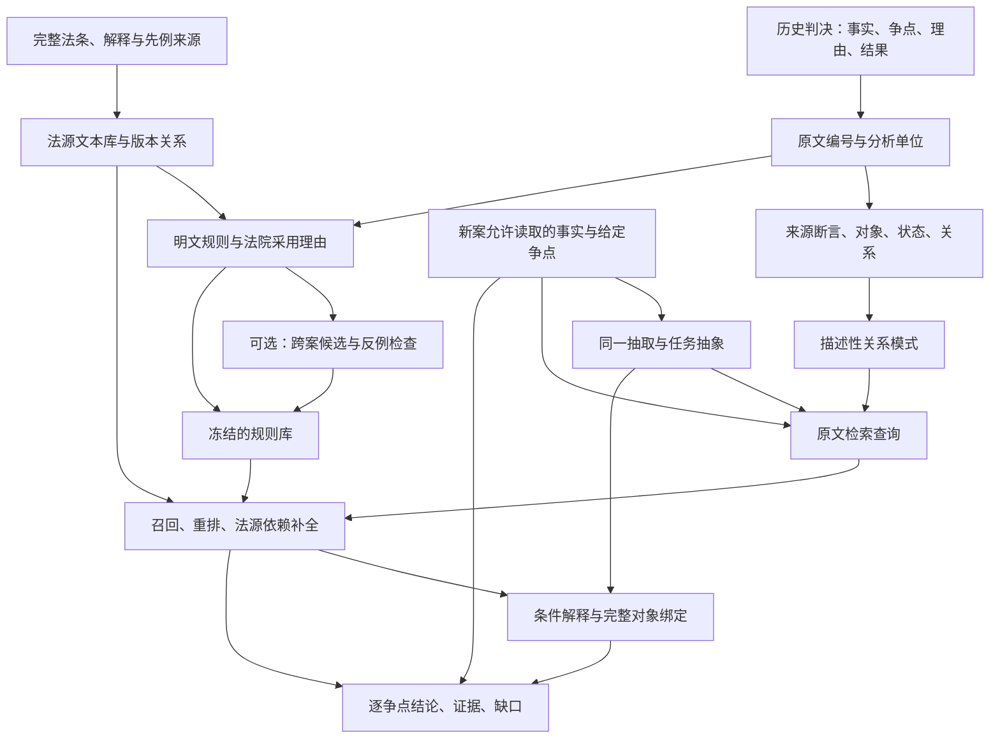

# 从案件与争点取得规则，再用于找法与请求判断：V1设计

日期：2026-10-01。状态：**完整设计；基础组件已部分实现，两案检查未通过，尚无完整法律实验**。实际进度见[阶段报告](../../../outputs/rules-verdict-v1/report-zh.txt)。本文件结合现有代码与[方案评审R2](../../reviews/2026-10-01-pro-rgcn-v1-review.md)，确定建议采用的主流程和后续对照。实施顺序、运行预算与验收见[实施与实验计划](IMPLEMENTATION_PLAN.md)。文中的组件名称包含待建接口，已实现范围以阶段报告和代码README为准。

研究目标是：从历史案件和法源取得有出处、可复用的规则，帮助新案件找到适用法律，并形成有依据的逐请求、逐争点结论。事实关系实验是中间诊断；benchmark是否成为主要成果，取决于后续证据。

## 1. V1采用什么

主流程采用固定LLM抽取与解释、混合文本检索、显式条件绑定和有限的规则组合。先把它与普通文本检索增强回答比较。第一轮不训练GNN、不扩大到100案、不重新标注旧20案。

| 组件 | V1采用 | 后续只在何种情况下尝试替代 |
| --- | --- | --- |
| 文本生成、抽取、规则提议 | 已有Qwen3.5-9B-4bit，MLX-VLM；JSON Schema生成约束 | 首轮完成后，另一个模型重复关键对照，检查结论是否仅属于9B |
| 来源与记录 | Python标准库、JSONL、SQLite；不可变原文和稳定位置 | 不先引入图数据库或分布式系统 |
| 事实类别与family | 版本化定义卡；原始断言到任务类别的保守映射 | 标注足够且类别混淆反复出现时，才尝试监督对比学习 |
| 关系模式 | 复用有类型的双事件候选搜索，保留对象绑定；开发数据生成 | 不先引入任意长度图模式搜索；低频法律例外由规则路径保留 |
| 明文规则 | 从完整条文、判决理由提取RuleCard，再单独核对原文 | 无须跨案支持也可保存单案明确表达的规则，但法律地位单列 |
| 跨案归纳 | 兼容案例分组、至多3个候选、困难近邻检查、至多1次有来源修订 | 材料不足时只完成明文规则提取，不强行归纳 |
| 法源召回 | SQLite FTS5/BM25 + Qwen3-Embedding-0.6B；RRF合并排名 | 先做BM25对照；图检索只有在同信息比较中值得测试时才加入 |
| 法源重排 | Qwen3-Reranker-0.6B；范围状态和文本相关性分别保存 | 后续可测试冻结GFM-RAG；有足够监督后再训练LawRanker |
| 条件应用 | 有类型变量的关系查询、共享绑定、AND/OR、显式否定、必要的日期/数值比较 | 法律规则不能表达的部分返回暂不支持；不删除条件来迁就程序 |
| 请求结论 | 执行结果表 + 原文 + 法源交给同一个9B；机械部分保留执行轨迹 | VerdictNet单独立项，有稳定请求标签后再比较 |
| 来源复核、参考答案 | 普通High网页模型，记录实际型号/设置；来源核对 | 不称人工金标准，不用网页修补受测模型的事实 |

检索所用0.6B模型是预训练编码器/重排器，不是另一个法律裁判生成模型。它们使用独立检索环境，固定revision与依赖；与9B顺序加载，避免同时占用统一内存。尚未完成本机适配与资源检查，不能把计划中的检索配置写成已验证性能。

## 2. 两条数据流

历史案例可以读取裁判理由和结果来取得规则。新案方法只能读取预先允许的事实、请求、争点和程序信息，不能读取正在预测的裁判结果、决定性理由或暴露答案的法源标签。新案不会在运行中更新共享规则库。

给定问题以一个分析单位为边界：`案件 + 请求/抗辩 + 争点 + 当前审理阶段`。V1以任务已经给定的争点为输入；自动发现争点可另作后续任务，不隐含在本轮成绩中。同一案件中的租金请求、转租腾退请求、上诉撤销请求分别记录，不能压成一个WIN/LOSE。案件来源阶段、事实发生时间、当前判断阶段是三个不同字段；早期事实可用于当前问题，早期被撤销的认定不能自动当作当前已采纳事实。

## 3. 所有组件共同读写的数据

| 对象 | 必要字段与用途 |
| --- | --- |
| SourceDocument | 文书ID、原始文件哈希、URL/页码、全文段落/片段ID、版本、日期、法域；原文只读 |
| CaseTask | 案件/纠纷组、请求人及相对方、请求、争点、阶段、时间基准、允许来源范围、待预测结果类型 |
| SourceAssertion | 原文位置、陈述者、所称行为/状态、肯定否定、法院处理状态、来源阶段；不把“当事人说”转成事实发生 |
| Entity / Event | 案内对象身份、对象类型、角色、事件参与者、时间和属性；身份与角色分开，姓名也不是身份合并的充分条件 |
| UnresolvedItem | 原因、原文位置、受影响的字段路径、是否可能影响整个命题；未知不覆盖已有可靠字段 |
| TaskAbstraction | 来源断言、定义卡ID、保留字段、被泛化字段、未表达内容、适用任务及版本；不覆盖SourceAssertion |
| Relation | 有方向的两端、关系类型、支持/反对/未确定、原文、来源状态；缺边不等于关系为假 |
| PatternCard | 自然语言意义、可执行查询、共享变量、产生方式、开发支持、未知与失败、匹配见证；地位为描述性模式 |
| AuthorityUnit | 法条款项/判决理由单元、完整上下文、有效版本、引用/定义/例外关系、来源与法律地位的不确定项 |
| RuleCard | 来源性质、适用范围、带类型变量、条件结构、必要/充分/因素性质、法律效果、例外、举证/证明规则、原文及形式化覆盖 |
| ApplicationTrace | 法源相关性、范围兼容、每个绑定及条件证据、缺口、冲突、可执行/模型判断部分、候选排除原因 |
| DecisionRecord | 逐请求结果、支持链和反对依据、未解决问题、预测与程序推导的区别、运行状态及所有版本哈希 |

RuleCard的来源性质使用`EXPLICIT_STATUTE`、`EXPLICIT_JUDICIAL`、`CROSS_CASE_HYPOTHESIS`；PatternCard另存。法律权威程度、法院是否实际采用、模型是否复核是独立字段。即使模型复核通过，也不能把归纳假说升级成有法律效力的规则。

编程上的成功/失败与答案分开。`run_status`继续使用OK、INPUT_TOO_LONG、OUTPUT_TRUNCATED、FORMAT_ERROR、TIMEOUT、OUT_OF_MEMORY、UNSUPPORTED；失败时答案为null。局部不支持保存在组件/条件层，不伪装为原文缺失。关系查询仍使用MATCH、NOT_FOUND、UNKNOWN。法律结果另设明确的请求/程序标签，并以`assessment_status`区分有支持、未决、争议和语言不支持，不能用MATCH表示“原告胜诉”。

## 4. 离线准备：历史案件怎样成为可复用知识

### 4.1 来源、时间与输入隔离

复用已有完整来源及固定候选顺序，先做任务清单，不重新筛整个库。保存准确重复、已知同纠纷和未确认关联；已知关联案件分在同一组。新案若与历史案例属于已知同一诉讼链，不能作为新纠纷测试。关联未确认的单独报告。

开发用判决保留全文。新案建立单独的允许输入视图，排除目标裁判理由、结论及直接泄漏标签的内容；引用这些内容的摘要、文件名元信息、向量文本也一并排除。切分困难时保留风险标记，不能声称消除了所有泄漏。若只有终审判决整理过的事实，任务称为“给定事实的法律适用/回顾性判断”，不宣称重现真实判前证据获取。

法源库先围绕开发中实际采用的一个法律制度建立：保存相应法律完整版本、相关定义与例外、开发判决引用的先例，以及同制度内的相邻条款。初始库不能只包含新案参考答案提到的正确法条。后续看到新案答案才加入的来源不得进入同一轮主要比较。

区分事件发生时、程序启动时、拟判断时所需的法条版本；不能简单按判决日期选最新法条。范围/版本无法确定时保留候选并标记未知，不自行解释追溯适用。这里做来源管理与条件化实验，不声称完整更新了全部印度法律效力。

### 4.2 抽取：先保留原句实际表达，再映射事实类别

使用9B与已有Schema约束机制，按原文顺序处理全部允许输入。初始每块最多4,000个模型tokens，重叠400tokens；不拆断有编号的句子，过长单句单独处理，超预算明确失败。只把LLM输入分块，原文不删除。每块输出一次，之后每案最多一次跨块身份/关系整理；不为每个可能事实类型反复要求模型“找出这种事实”。

每条抽取同时输出：来源片段、主体和客体的局部提及ID、原文所说的行为、候选类别、陈述者与处理状态、否定、限定和受影响字段。允许OTHER和UNKNOWN，防止把“房东需要自用”硬塞入“已经转租”。多个类型竞争时保留原文描述和争议，不靠类型枚举强迫选择。

对象类型按选定规则实际需要扩展：除已有PERSON、ORG、GROUP、PROPERTY，可增加LEASE/CONTRACT、NOTICE等明确对象。它们是保存身份的类型，不表示自动新增法律关系。新增类型及槽位须在开发期有来源样例并冻结。金额保留数值、币种、期间；时间保留原文与可解析范围，无法规范化时保留未知。

跨块合并只自动去除同原文位置、同含义的重复记录。相同名字、相同角色、相似描述只用于提出身份候选。LLM的整理包包含候选提及及相关原文，输出有证据的same-entity决定、方向关系或未确定；程序不按名字自动合并。缺乏关系的记录保留分离身份；别名表、同一对象和群体成员是不同关系。

证据以稳定片段ID及可选原文偏移返回，转换器据此复制原文，不要求模型重新拼写长引文。程序检查ID、对象引用、类型和完整性，并保留Schema生成过程、原始输出和转换日志。能定位的引文仍可能不支持所抽事实；这项语义风险留在评测中，不能由格式通过替代。

已知粗类型与命题成立分开。欠租期间未知不应把可靠的付款类记录放入转租候选池；它仍可能在肯定性、金额、日期或合同归属上不可用。限定影响整句或无法确定影响字段时，继续保留整句阻止。不存在自动删除`*`或关键词猜测限定意义的步骤。

### 4.3 规范化、cluster与family

V1先建立与目标争点有关的少量定义卡，每张写清类别意义、必需角色、保留差异、允许的泛化和边界例子。例如“付款”可以是family，“足额支付指定租约的租金”是更细的任务表示；欠租、部分付款、已付款的当事人主张不能因词语相近被合成同一种肯定事实。

抽取先保留忠实断言，再尝试归入卡片。候选卡用名称/别名检索获得，数量增长后可复用0.6B向量检索。LLM判断是否符合整个定义，输出来源理由；没有合适卡就返回未归类候选，不修改现有定义来容纳它。开发期集中整理未归类项，冻结后新案不创建全局类别。

这里的cluster是跨案表达落入同一个定义，family是多个定义共享的较宽主题。事实记录始终保留案内对象、数量、时间、状态与出处。检索可使用宽family，法律条件只能使用保留了所需差异的表示。一个抽象视图不应被当成所有法律任务都成立的全局等价关系。

首轮无需完成全语料聚类。对比学习、DBSCAN或LLM批量合并只有在有独立同异参考且当前映射确实成为瓶颈时才做对照；向量距离不能直接决定法律等价。

### 4.4 描述性模式：保留已有算法的适当位置

在开发事实中枚举两个事件，泛化具体名字，保留共享对象以及已支持的part_of/member_of方向。按规范化查询字符串去重，固定候选预算1,000，至少在两个不同开发分析单位且来自不同案件中出现才标记为重复；同一案件不因多条见证重复计数。另报告已知纠纷分组后的支持数和关联未确定项，不能把两个案号等同于两个独立纠纷。

候选的陈述状态和未知依赖来自定义卡；只使用可进入相应用途的字段。保存所有候选、执行结果、见证与截断位置。无时间来源就不加时间条件，未知不作确定不匹配。模式优先帮助检索、比较案件和提出规则材料候选，不决定法条内容或裁判结果。

模式搜索限制两个事件，法律规则的条件数不受这一限制。五个真实条件必须全部表达，或明确报告不支持；不能删成两条以复用旧搜索器。已有三个关系题原样作为诊断，不自动成为三个法律要件。

### 4.5 明文规则：从法条和法院实际采用的理由提取

对每个历史分析单位建立规则材料包：争点、事实依据、法院采用的命题、理由原文、法源、程序阶段及结果。原文引用他人观点、当事人主张、法院否定的解释和法院采用的解释分开。先保存RuleCard的自然语言版本，再编译可执行部分。

RuleCard要回答：规则约束什么人/物/关系；什么条件共同成立；结论是必要条件、充分条件、支持因素还是例外；是否有证明责任、反证或程序限制；哪段来源支持这些解释。原文没写清“当且仅当”，不能由编译器补成双向规则。

开发期用普通High对完整来源与候选卡作一次来源复核，保留分歧。未通过语义核对的卡可以作为检索线索，不进入确定性法律推导。采用的自然语言解释和程序表达应逐条件对应；类型检查、可执行性和模型同意都不证明法律解释正确。

### 4.6 可选跨案归纳：有来源约束的有限搜索

按争点、法域、相关法律版本、程序阶段和解释范围分组。兼容材料支持归纳时，9B每组至多提出3张候选卡。输入包括规则材料包和描述性模式，输出必须指出新增概括是什么，是否已经被某份判决明确表达，以及哪些条件仍属假说。

每个候选最多检查6个已有兼容近邻：优先事实相似但结果不同的案例，也检查结果相同而理由不同的案例。某条件在文本中没出现，不足以反驳它的必要性；需要说明该条件确实不成立或无法承担所宣称的作用。检查结果分为支持、真正反例、范围不兼容、信息不足。

每候选至多一次局部修订，允许补入来源明确的遗漏条件、缩小范围、补充有法源支持的例外或纠正绑定；不允许仅因预测错就改写法律含义。保存所有原候选和失败。最后冻结候选及来源，所有跨案候选仍带HYPOTHESIS标记。

这借用[SILVER/LRI](https://arxiv.org/html/2505.14104v2)的提出、验证、更新结构，以及[RLJP](https://arxiv.org/html/2505.21281v1)的困难案例选择思路。这里的接受依据是来源与适用边界；多数支持或更高预测分数都不能证明规则在法律上成立。

## 5. 在线处理：新案怎样得到法源与结论

### 5.1 同时使用原文查询和结构化查询

新案按同一规范抽取。建立两个检索查询：其一为给定争点、请求、阶段及原文事实描述；其二由有来源的类型、角色、对象关系和已匹配模式组成。结构化查询不能带参考答案、目标判决引用或模型猜测的胜败标签。

两个查询分别走BM25和向量召回，每路最多50项，合并前至多200项。向量使用[Qwen3-Embedding-0.6B](https://huggingface.co/Qwen/Qwen3-Embedding-0.6B)，1024维、归一化、余弦相似度；查询指令写明是查找相关法律条件和先例。小库直接矩阵检索，无需向量数据库。

用RRF按名次合并：每项得分为各路`1/(60+rank)`之和，相同分数按稳定法源ID排序。保存单路排名，才能判断优势来自文本、结构还是更多检索次数。旧法源版本不覆盖，明确不兼容的范围可排除，未知范围保留标记。

### 5.2 重排与法源上下文补全

RRF前40项交给[Qwen3-Reranker-0.6B](https://huggingface.co/Qwen/Qwen3-Reranker-0.6B)，询问该单元是否能帮助判断当前争点，包括支持或反对请求的法律依据。初选前8个单元，随后沿明确的定义、例外、修订、引用依赖补充，最多2轮、总计24个单元。数字是开发初值，资源与覆盖检查后冻结，不是论文已证明的最优值。

索引以完整条款/理由段为基本单元，长单元分为带父ID的检索片段；命中片段后读取完整父单元及必要依赖。不能沿用模型示例中的静默截断来丢掉“但书/除外”。材料超过重排或生成预算时记录未覆盖部分；确定性推导不得使用缺少必要上下文的RuleCard。

分别保存`relevance`、`scope_compatibility`和后续`condition_evidence`。例如付款条件不满足，相关支付或腾退条款仍可能是驳回或支持请求的依据，不能因此被检索层删除。若已知不满足的是法域等规则自身适用范围，才作为范围排除处理，并保留出处。

### 5.3 条件映射：将文字要求连接到具体事实

在开发期，为选定RuleCard生成条件到定义卡/字段的映射；新案用冻结映射执行。尚无映射的明确法源可做文本解释，但标记为LLM判断，不临时创造新谓词后冒充已验证程序。

每个条件声明依赖：事实类型、参与者、合同/财产身份、关系方向、陈述状态、否定、必要时间或数值。先排除可靠类型已不相符的记录，再检查其余依赖。日期未知仅阻止日期判断；状态未知仍阻止把记录当作法院认定的肯定事实。

程序先按类型和可用状态建立索引，逐条件得到候选绑定表。AND对共同变量做连接，OR保留分支及来源；绝不先把每行压成真/假后相加。执行顺序按可用候选数、条件ID固定排序，以索引连接减少笛卡尔积；未确定值不能假装与任意具体值相等。开发初始每案每规则最多扩展10,000个部分绑定，保存计数与停止位置，不用按模型分数丢掉低分绑定的beam search。类型相同不意味着身份相同；同一人不意味着该人属于被请求人群体；没有part_of边不意味着对象互不相关。暂不默认关系传递闭包。

### 5.4 条件执行与法律组合

V1的受限规则表达包括带类型变量的原子查询、局部存在量词、AND/OR、来源明确的否定事实、对象同异、已有方向关系，以及选定真实规则所需的日期/数值比较。金额以Decimal和币种比较；日期只在来源粒度允许时比较。金额累计、付款分摊、无限递归、未界定量词和开放性权衡暂不进入机械执行。

每个绑定上的条件保存四种证据状态：SUPPORTED、REFUTED、CONFLICTED、UNRESOLVED，并保存双方证据。REFUTED需要与该绑定相容的反对依据；查询空集不是反对依据。冲突不会使所有结论任意成立。不同假设分支、互不兼容的陈述状态或已撤销认定不能拼接成同一支持链。

原子AND/OR先产生绑定与证明见证，再汇总存在性结果。有至少一个条件齐全且无相关阻止的见证可报告MATCH，同时列出其他冲突。没有完整见证但存在关键待定组合则UNKNOWN；只有规定范围内无见证且无关键待定组合才NOT_FOUND。枚举预算耗尽返回局部UNSUPPORTED/覆盖未完成，不能把未搜索完写成NOT_FOUND。

法源的法律后果由RuleCard中的连接解释：必要条件满足不能独自推出请求成立；支持因素不能变成充分条件；例外的适用及默认处理须有规则依据。未证明某事实与事实不存在分开，只有明确的举证/证明规则能把证明不足连接到法律后果。

旧执行器支持1—4个原子，现有模式搜索主要使用两个事件。新建规则组合层把各条件的绑定表连接，不通过拆成几个布尔查询来规避旧上限。保存全部实际法律条件；程序暂不支持的部分仍留在卡片和结果中。

### 5.5 请求结论与有限补查

每个分析单位生成一张应用表：相关法律、适用范围、完整绑定、条件支持/反对/未知、例外、证明责任、可推出的法律效果及未形式化问题。9B读取应用表、相同允许事实与所选原始法源，输出请求/程序结果、证据链、相反依据及缺口。

结果应区分“某项实体要件不满足”“本阶段请求不获支持”“撤销/发回”“部分支持”“材料不足”；标签由开发样本和任务定义确定。模型可以给出预测，但程序会单独核验引用、绑定和确定性推导是否支持该预测。不受执行结果支持的结论保留为模型判断/冲突，不修改事实让它成立。

第一轮主比较关闭补查反馈，先定位原始流程。之后只增加一个单独实验：每案最多1轮、最多2个具体缺口，在同一允许原文/冻结法源库中查找，不能进入目标判决答案区或开放网络搜索。找到的证据写成新记录并只重算受影响绑定；未找到仍保留缺口，不新增全局规则。额外调用和预算单独报告。

这参考[LegalGraphRAG](https://arxiv.org/html/2605.28120v1)的条件核查与补充检索安排，但本方案保留可能用于否定请求的相关法源，不以条件不成立为由将其全部裁剪。

## 6. 一个贯穿示例：对象连接怎样影响结论

以下是说明程序逻辑的虚构材料，不代表印度法律。假设某个已核对的规则要求：“同一租约存在欠款，并已就该租约送达通知”，且这些仅是若干必要条件中的两项。

| 原文片段 | 来源断言 | 程序保存 |
| --- | --- | --- |
| p1：租户T在租约K1下有欠款。 | 欠款涉及T、K1 | `Arrears(T,K1)`，肯定性与来源状态单列 |
| p2：一份关于租约K2的通知已送达T。 | 通知涉及T、K2 | `NoticeServed(N1,T,K2)` |
| p3：另提到一份通知N2，但没有说明针对哪份租约。 | N2归属未确定 | `NoticeServed(N2,T,?)`，未知只影响lease_id |

共现方法看到欠款和通知同时出现，产生候选。关系执行器先尝试T、K1、N1，发现K1与K2不同；这一组合失败。再检查N2，由于其租约未知，案件对这项存在性问题返回UNKNOWN。不能由N1失败推出全案无有效通知，也不能由材料里有通知直接认定K1条件满足。

若没有N2且规定输入范围内无其他候选，结果是NOT_FOUND，含义仍是未找到完整见证。即使新证据确认N2针对K1，也仅满足这两项条件；仍须检查完整规则中的其余必要条件和例外，才能判断请求。这个例子说明关系执行可能减少对象误接，但不证明抽取、法律解释或最终预测已经正确。

## 7. GNN、规则归纳和后续研究分别承担什么

冻结的[GFM-RAG](https://arxiv.org/html/2502.01113v3)可作为后续图检索迁移对照。先检查官方checkpoint、本机运行和图适配；把“当事人主张P”直接变成无条件三元组P会破坏状态，因此断言要单独成节点，连接来源和状态。它用于候选检索排序，不替代条件执行。通用问答中的迁移结果不保证法律任务有效。

若已标注足够的法源候选，才训练LawRanker：以争点、事实/模式、规则条件、法源单元为节点，有类型边；先比较同特征线性/MLP，再比较R-GCN。检索标签区分决定性、相关、明确无关、未判断；未判断不能作为负例。相关法律即使导致请求失败，也可以有高相关标签。

VerdictNet另行判断是否需要。其输入只含允许事实、检索到的法源与应用状态，不能使用目标案结果或按正确答案构造的图。训练时使用分组交叉拟合的上游检索/应用结果，避免用训练真值替换测试时预测。先比较同信息序列化LLM与MLP，再判断图传播是否有价值；双网络无需同时上，也无需同一结构。

R-GCN的边传播不会自动实现逻辑AND/OR；同一个事实衍生的多个模式也不是多份独立证据。若以后使用争点相关的关系门控，一个门控系数对应一种边类型，并不等于对每条边独立赋权；只有一个争点的试验也不能证明模型学会跨争点选择。

这些是后续可检验设计，不是V1成立的前提。V1最先检验：在相同材料和模型下，有出处的规则、完整对象绑定及字段级未知处理，是否让找法与请求判断更可靠；同时允许结果显示结构化成本大于收益。

## 8. 当前实现能复用到哪里

| 现有文件 | 复用内容 | 明确缺口 |
| --- | --- | --- |
| `legal_bench/field_pipeline_v2.py` | 已知字段、限定影响范围、类型先筛、逐候选原因 | 新规则的多条件绑定组合、法律效果尚未实现 |
| `legal_bench/typed_relations.py` | part_of/member_of、方向、身份区别、来源限制 | 不提供任意法律关系或默认闭包 |
| `legal_bench/mlx_json_constraint.py` | MLX生成中的Schema语法约束 | 不核验事实或规则语义 |
| `legal_bench/compact_output_v3.py` | 片段ID证据、格式转换、未知字段声明的思路 | 原格式有固定类型、数组上限和无时间属性设计；不能原样承担新法律任务 |
| `legal_bench/split_assembly_v1.py` | 多次输出合并、ID与条数检查 | 需要新格式适配，不猜测跨块身份 |
| `legal_bench/scoped_mining.py`、`legal_bench/typed_relations.py` | 前者的两事件搜索/预算与后者的有类型边候选，分别通过适配器调用 | 不是一个现成通用挖掘器；旧状态限制需显式适配，不把支持数解释成法律效力 |
| `scripts/local_qwen_worker_v3.py` | 固定模型、tokens/内存/时间记录、失败保存 | 路径与旧任务固定；新入口参数化，旧脚本不改写覆盖 |
| `scripts/repository_bridge.py` | 版本、审阅分卷、哈希和公开白名单 | 不自动同步网页聊天；本地prepare也不等于已发布 |

所有新组件放入独立命名空间，保持历史方法与结果原字节。具体里程碑和下一步提交内容见[实施与实验计划](IMPLEMENTATION_PLAN.md)。
