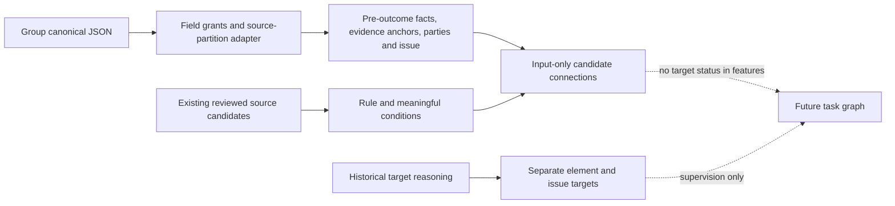

# 最小接口与边界

实际组内适配只用完整合成canonical fixture检验；八案没有真实组内canonical产物，复用了旧本地弱事实。不能把两条数据路径合称已复现。

本轮原始输入和输入图先于目标提议生成，包含原有事实、对象关系、出处及按机制选择的法源。目标构造可以读取完整历史文书。它产生的条件和有符号绑定存入task-layer-candidates，不自动进入input-graphs；独立来源审阅也不等于已经证明推断时可获取。

下一轮真正运行图模型时，条件定义须由法源独立形成；候选连接须只读取相同允许输入。历史采纳/拒绝、要件结果、目标裁判和目标使用法源的边仅作监督。先验证真实组内产物及阶段许可，不能由adapter把目标法院的ACCEPTED状态改成新的“事实已成立”。

三个应用标签仍为SATISFIED/DEFEATED/UNRESOLVED；basis_kind保留事实反证、未完成证明、未裁判与资料不足之别。不同审理阶段的SUPPORTED issue结论，不等于每个要件均SATISFIED。
