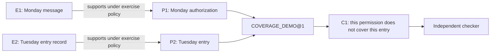

# One complete teaching case: permission on Monday, entry on Tuesday

This is the Guide 4.0 synthetic exercise. It is not a judgment, prediction or approved legal rule. `CHECKED` below means checked under the declared exercise policy only; every result retains `legal_approved: false`.

## 1. Open the source and premise

| Source | Saved content | Proposition |
| --- | --- | --- |
| [E1](trusted/documents/E1.txt) | Person_A may enter Parcel_P on Monday, 2026-10-12, for entry only. | P1: AUTHORIZATION(Person_A, Parcel_P, Monday, entry) |
| [E2](trusted/documents/E2.txt) | Person_A entered Parcel_P on Tuesday, 2026-10-13. | P2: ENTRY(Person_A, Parcel_P, Tuesday, entry) |

[S1](trusted/snapshots/S1.json) stores exact source ranges, document-byte hashes, typed entities, attributed record status, assessments and exercise review records. These are stipulated inputs, not an LLM's self-certified extraction. P3, the query about Tuesday authorization, remains UNKNOWN and is kept outside the accepted premise set.

## 2. Follow the typed graph

The actual [typed edge records](typed_edges.json) retain relation meanings and source links. A rule dependency is not a support vote. The separate [signed numeric exercise](spectral-exercises.json) preserves simultaneous +3 and -3 channels and flags its nonunique axis; these synthetic conflicts are not added to case evidence.

## 3. Check the narrow result

[C1](runs/S1-specific-mismatch/certificate.json) references S1, P1, P2 and COVERAGE_DEMO@1. Its [independent check](runs/S1-specific-mismatch/checker_result.json) recomputes:

| Test | Result |
| --- | --- |
| Same person | TRUE |
| Same property | TRUE |
| Tuesday within Monday's interval | FALSE |
| Entry within the authorized activity | TRUE |
| This authorization covers this entry | FALSE |

The narrow mismatch derivation is CHECKED. [“No authorization exists”](runs/no-other-authorization/checker_result.json) and [final liability](runs/final-liability/checker_result.json) remain INCOMPLETE because the narrow rule cannot establish either conclusion. Failure to establish a broader conclusion is not an UNKNOWN answer replacing technical failure.

## 4. Refuse a wrong derivation

The [wrong-parcel certificate](runs/wrong-parcel/certificate.json) substitutes Parcel_Q in the proposed binding. The checker loads P1/P2 from the trusted snapshot and returns [INVALID / BINDING_MISMATCH](runs/wrong-parcel/checker_result.json). A [forged TRUE result](runs/false-result-claim/checker_result.json) is also rejected. The generator's labels do not control acceptance.

Other [curated mutations](mutation-report.json) cover missing premises, source/locator changes, party assertions presented as accepted findings, unapproved or wrong-stage rules, missing rule versions, circular dependencies, self-certification, stale versions, empty answers and duplicate answers. Missing exceptions and conflicting assessments remain visible. The acceptance set also contains valid positive and negative proofs, so an always-reject checker cannot pass this exercise.

## 5. Apply an additive correction and reopen history

The synthetic [patch](patch.json) adds [E3](trusted/documents/E3.txt), a separate Tuesday authorization, and P4. [Patch validation](patch-validation.json) verifies that the previous records remain unchanged. This is an exercise review, not a real human approval.

[S2](trusted/snapshots/S2.json) contains P1, P2 and P4. [C2](runs/S2-corrected-coverage/certificate.json) uses P4/P2, and the [checker](runs/S2-corrected-coverage/checker_result.json) returns CHECKED with coverage TRUE. P1 was not rewritten from Monday to Tuesday.

[C1 reopened against S1](runs/S1-historical-reopen/checker_result.json) remains CHECKED historically. [C1 presented as current S2](runs/S1-as-current-S2/checker_result.json) is INVALID as stale. The [dependency index](dependency-index.json) identifies which records and tests differ.

## 6. What remains unapproved

[Approval gaps](approval-gaps.json) are part of the deliverable. No real legal conclusion, burden allocation or general liability rule is approved. This exercise validates a bounded engineering contract and records the remaining work for a real source-to-certificate teaching judgment.
